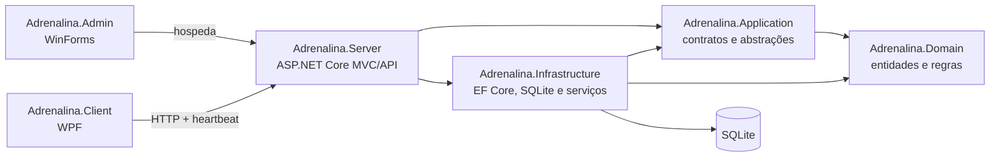

# Arquitetura do Adrenalina

## Objetivo arquitetural

O Adrenalina é um produto desktop Windows com servidor local. A arquitetura favorece implantação simples em uma única lan house, operação offline da internet e isolamento entre administração e estações. O banco pertence exclusivamente ao Server; Clients acessam o sistema somente pela API HTTP.

## Componentes suportados



Os antigos `Adrenalina.ClientShell` e `Adrenalina.ClientAgent` foram removidos por duplicarem responsabilidades e conterem caminhos de controle do Windows incompatíveis com o produto seguro.

## Responsabilidades

### Adrenalina.Admin

- ciclo de vida do servidor embutido;
- configuração de escuta local/LAN;
- status e endereços de conexão;
- abertura do painel por WebView2 ou navegador;
- solicitação explícita de backup;
- `Admin.log` para eventos do processo desktop.

Não deve conter regras de cobrança, persistência SQLite nem controle do Windows das estações.

### Adrenalina.Client

- preparação da estação;
- login por usuário e PIN;
- apresentação de sessão, saldo, tempo, avisos e conectividade;
- fila local de solicitações;
- retry, heartbeat e confirmação de mensagens;
- `Client.log`.

O Client não deve abrir o banco do Admin, executar comandos administrativos do Windows ou depender de UI do Admin.

### Adrenalina.Server

- endpoints MVC e API;
- autenticação, autorização, CSRF, cookies e rate limiting;
- composição do host, health check e limites HTTP;
- `Server.log`.

Controllers devem apenas validar a borda HTTP, chamar casos de uso e traduzir resultados.

### Adrenalina.Application

- DTOs e contratos compartilhados entre processos;
- interfaces de casos de uso e armazenamento local;
- validações independentes de infraestrutura;
- serialização e hashing compartilhados.

### Adrenalina.Domain

- entidades, enumerações e invariantes do negócio;
- nenhum acesso a arquivos, HTTP, UI ou EF Core.

### Adrenalina.Infrastructure

- `AdrenalinaDbContext` e configuração do SQLite;
- inicialização/upgrade aditivo do esquema;
- implementação dos casos de uso;
- exportação TXT, Excel e PDF em componente dedicado;
- armazenamento JSON atômico;
- backup, exportação e logging em arquivo.

## Regra de dependências

Direção aceita:

```text
Admin  -> Server, Application, Infrastructure
Client -> Application, Infrastructure
Server -> Application, Infrastructure
Infrastructure -> Application, Domain
Application -> Domain
Domain -> nenhuma camada do produto
```

Não há referência circular entre os projetos suportados. A referência do Client para Infrastructure existe hoje apenas por implementações de armazenamento e observabilidade. No futuro, essas implementações podem migrar para um projeto específico `Adrenalina.Client.Infrastructure`, sem alterar o protocolo.

## Decisão sobre projetos Shared

Não foram criados `Shared.Contracts`, `Shared.Abstractions`, `Shared.Common`, `Shared.Models`, `Shared.Validation` e `Shared.Localization` separados.

Justificativa:

- `Adrenalina.Application` já concentra contratos, abstrações e validações sem depender de infraestrutura;
- `Adrenalina.Domain` já é o modelo compartilhado de negócio;
- seis novos assemblies aumentariam restore, versionamento, navegação e acoplamento de solução sem criar limites de implantação reais;
- o problema atual é a concentração de muitos tipos em poucos arquivos, não a ausência de assemblies.

Quando o protocolo precisar ser versionado independentemente do Server, vale extrair um único `Adrenalina.Contracts`. Até lá, a preferência é dividir `Contracts.cs` por assunto dentro de `Application`.

## Persistência

- SQLite em `%LocalAppData%\Adrenalina\Admin\adrenalina.db`;
- `Foreign Keys=True`, timeout de escrita e pooling desabilitado;
- WAL e `synchronous=NORMAL` para melhor concorrência local;
- índices para sessão, máquina, comandos, avisos, financeiro e solicitações;
- índice parcial único impede mais de uma sessão ativa por máquina;
- novas bases recebem relacionamentos e regras de exclusão pelo modelo EF;
- bases existentes recebem upgrades aditivos por `AdrenalinaDatabaseInitializer`.

Não existe ainda um pipeline formal de EF Migrations com rollback. Essa é uma dívida de release 1.0.

## Protocolo e confiabilidade

- heartbeat periódico com timeout;
- máquina deve ser pré-cadastrada por chave;
- fila local de solicitações gravada atomicamente;
- cada solicitação possui `RequestId` idempotente;
- reenvio do mesmo lote não duplica registros;
- comandos e avisos permanecem pendentes até ACK do Client;
- redelivery é deduplicado no Client pelo identificador;
- login nunca é armazenado para tentativa offline.

O protocolo ainda usa HTTP em LAN e a chave da máquina não é uma credencial criptográfica. TLS e provisionamento de credenciais por estação pertencem ao roadmap de segurança.

## Segurança

- cookies HttpOnly, SameSite Strict e Secure quando HTTPS estiver ativo;
- antiforgery nos formulários mutáveis;
- rate limiting por IP no login e na API do Client;
- PBKDF2-SHA512 com salt e comparação em tempo constante;
- respostas genéricas de login evitam enumeração direta;
- Data Protection isolado no diretório do Admin;
- comandos de reinício, logout, captura e limpeza são rejeitados;
- nenhum componente suportado altera firewall, Registro, serviços ou processos do Windows.

## Observabilidade

```text
%LocalAppData%\Adrenalina\Admin\logs\Admin.log
%LocalAppData%\Adrenalina\Admin\logs\Server.log
%LocalAppData%\Adrenalina\Client\logs\Client.log
```

Cada arquivo gira para `.1` ao atingir 10 MiB. O banco mantém auditoria funcional separada dos logs técnicos.

## Dívidas arquiteturais conhecidas

1. `CafeManagementService` ainda concentra casos de uso demais. Inicialização e formatação de relatórios foram extraídas, mas sessões, usuários, backup e sync devem ser separados gradualmente.
2. `MainForm` e `MainWindow` mantêm muito código de apresentação em code-behind.
3. `Contracts.cs` e `Core.cs` devem ser divididos por contexto sem criar novos assemblies prematuramente.
4. O tema claro permanece no contrato por compatibilidade, mas não deve ser reativado até existir um design token completo e teste de contraste.
5. O acesso inicial já é aleatório e descartável, mas ainda precisa de um onboarding guiado com troca obrigatória na primeira sessão.
6. Usuários, configurações e auditoria já exigem `Admin`; permissões de operação ainda precisam evoluir de regras por controller para políticas por ação.
7. Artefatos gerados antigos ainda presentes no histórico do Git devem ser limpos em uma manutenção separada do histórico.
